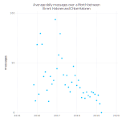
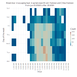
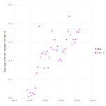

# MessengerAnalyze.jl
This package allows you to analyze Facebook messenger conversation between yourself and anyone you message.
Takes conversations between two people and produces a plots. Daily messages per month, day-week-hour analysis, topic extraction, and topic discussion levels over time are all extractable.


Download your Facebook archive. This is detailed at the following link. Choose the JSON download option.
https://www.facebook.com/help/131112897028467
Uncompress the archive in a specifically created folder.
Install julia, then enter package mode by typeing `]` then 
```
pkg> add https://github.com/bhalonen/MessengerAnalyze.jl
```
in the julia terminal.

Load the package with the following command.
```
using MessengerAnalyze
using TimeZones
using Dates

```

To extract your messaging data, run (tz"EST" if you are in the eastern time zone)
```
your_data=extract_conversations("<path-to-your-folder>",  tz"<your-timezone>")
```
## Average Messaging over time
One simple variable to check is the overall level of messaging activity with someone. Are you messaging someone nonstop, or are you barely messaging at all?
 You can choose to aggregate over months, weeks, days (weeks seem somewhat less noisy). You can choose daily average or total messages as a plotting option.
```
daily_messaging_plot(your_data,"username1","username2", DateTime(2015,10,1), DateTime(2016,6,1), Dates.Week,DailyAverage)
```
An example of this plot can be seen between in my conversation with my wife.


You can see that our messaging ramped up very quickly after we met and really petered off as we got engaged then married, and spent far more time together in real life.
## Heat map over hour of the day vs day of week
Another varible to check is when you are messaging during a week over a long period of time.
```
hours_vs_week_plot(your_data,"username1","username2", DateTime(2015,11,1), DateTime(2016,6,1))
```
An example of this plot can also be found in my conversation with my wife. You can see most of our messaging when we are married occurs when we are apart during the work day.


## Topic extraction
Topic extraction is the process of labelling each word of the run through an algorithm called [Latent Dirichlet allocation](https://en.wikipedia.org/wiki/Latent_Dirichlet_allocation). This process takes a group of documents (called a corpus) and discovers clustering among words used and documents. You instruct the process how many topics you want to clustered, and it will find that number.

The first step of this process is creating a corpus. Since each message is very short, they must be collated together to provide some context. A window of time must be selected as well, I chose an `Hour` block as it seemed about a natural "chunk" of conversation. `two_way_corpus` gathers conversation in each direction, `one_way_corpus` will only collect one direction of the conversation.
```
corpus = two_way_corpus(your_data, "username1","username2", DateTime(2015, 11, 1), DateTime(2019,4,15), Hour )
```
This step also cleans the data up, removing uninteresting words, punctuation, and simpifying words through [stemming](https://en.wikipedia.org/wiki/Stemming).

A number of topics is selected, then the lda analysis can be run on the corpus. This is computationally intensive and if you are on a smaller computer, dial the number of iterations back a bit.
```
ϕ, θ, corpus_dtm = build_lda(corpus, topic_count, number_iterations=10000)
```
Three items are returned. `ϕ` is a sparse array (meaning not every entry is availible) of words to topic weighting. `θ` is a dense array of topic ratings of each document or hour block of conversation, and `corpus_dtm` is a [Document Term Matrix](https://en.wikipedia.org/wiki/Document-term_matrix).

One quick way to get a sense of what the topics are is to list the most highly rated words in each category using `topic_top_words`, in this case listing 10 words from each topic.
```
topic_top_words(ϕ, corpus_dtm, 10)
```

The output from my conversation with my wife lists the following topics.
```
8-element Array{Array{String,1},1}:
 ["look", "wow", "yeah", "fun", "cute", "re", "hahahah", "love", "oh", "nice"]              
 ["hope", "probabl", "talk", "pretti", "sound", "nice", "fun", "time", "day", "yeah"]       
 ["look", "feel", "chloe", "morn", "goodnight", "brent", "night", "nice", "sleep", "love"]  
 ["hope", "check", "don", "nice", "send", "look", "maker", "sent", "call", "babi"]          
 ["time", "doe", "veri", "probabl", "realli", "ve", "tri", "hard", "yeah", "peopl"]         
 ["support", "rape", "twitter", "war", "wonder", "appar", "power", "news", "peopl", "trump"]
 ["look", "ve", "art", "probabl", "sound", "book", "stuff", "yeah", "pretti", "read"]       
 ["tonight", "lunch", "hous", "meet", "dinner", "head", "home", "leav", "ok", "sound"]    
```
Clearly there are a few here.

To check how the topics are graphed over time call
```
plots = plot_topics(θ::Matrix, corpus::Corpus)
```
For my experiment, the topic 8 (last) chart indicates that we have been talking about food at an increasing rate over our relationship, with a jump step when we started dating.

